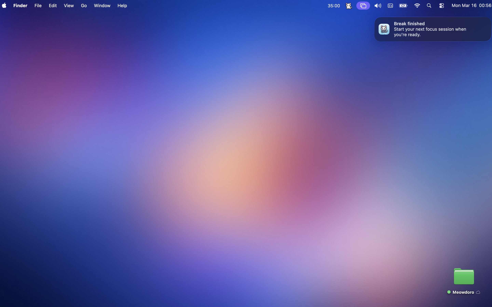

# Meowdoro

A tiny focus companion that lives in your Mac’s menu bar.

---

## Why Meowdoro?

I didn’t want another productivity tool.

I wanted something that doesn’t feel like an app.

Something that just sits there while you work.

So I built Meowdoro.

---

## What is Meowdoro?

Meowdoro is not just a timer.

It’s a small presence in your menu bar that helps you focus without getting in your way.

No setup.  
No friction.  
No interruptions.

Just you, your work, and a tiny cat 🐈

---

## Screenshots

### Menu Bar Timer

### Customization

### Dashboard

### Notifications

---

## Key Features

• Lives in the macOS menu bar  
• Starts instantly  
• Minimal, distraction-free experience  
• Lightweight focus tracking  
• Designed as a quiet work companion  

---

## Built With

Swift  
SwiftUI  
macOS Menu Bar App architecture  

---

## Download

Mac App Store Link: https://apps.apple.com/tr/app/meowdoro/id6760627293?mt=12

---

## Support

https://tally.so/r/9qlZRY

---

Built by **Gorkem Sertgumec**
