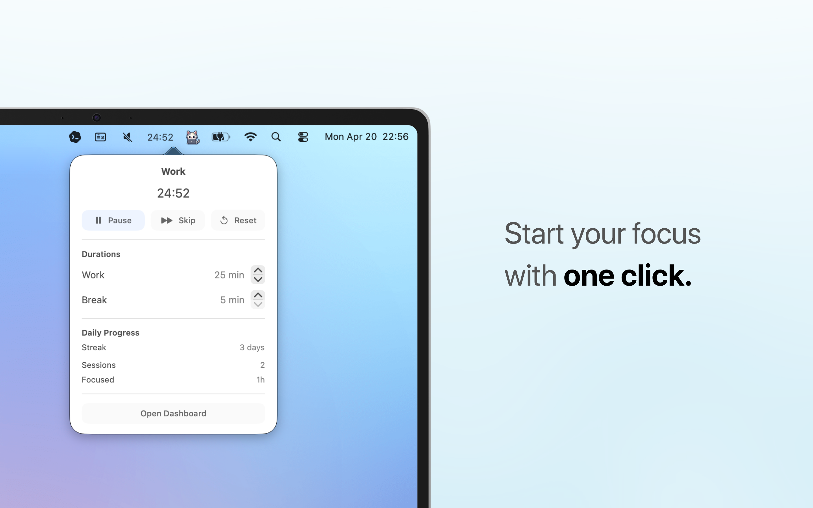
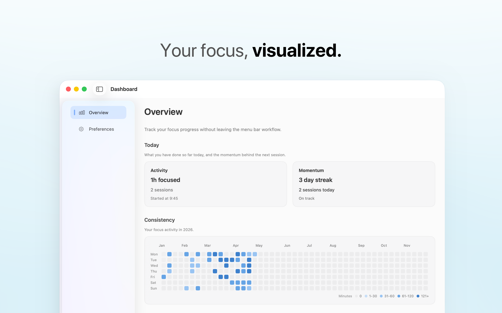
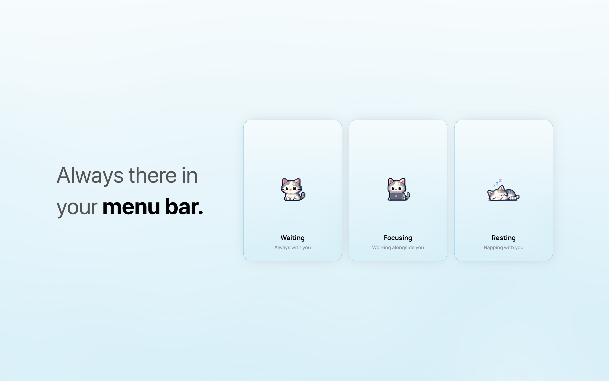

# Meowdoro

A tiny focus companion that helps you start.

Stay focused without breaking your flow.

---

## What it is

Meowdoro is a lightweight focus timer designed to stay out of your way.

No setup.  
No friction.  
Just click and start.

---

## Why Meowdoro

Most productivity tools try to do too much.

When you just need to focus,  
they slow you down.

Meowdoro does less.

So you can start faster.

---

## Screenshots

### Start your focus with one click

### Your focus, visualized

### Always there in your menu bar

---

## Features

- Menu bar Pomodoro timer  
- Instant start  
- Work / break cycles  
- Adjustable durations  
- Gentle notifications  
- Lightweight focus tracking  
- Monthly focus heatmap  

---

## Philosophy

Starting is the hardest part.

Meowdoro removes the friction to begin.

---

## Built With

Swift  
SwiftUI  
macOS Menu Bar App architecture  

---

## Download

https://apps.apple.com/tr/app/meowdoro/id6760627293?mt=12

---

## Support

https://tally.so/r/9qlZRY

---

Built by **Gorkem Sertgumec**
