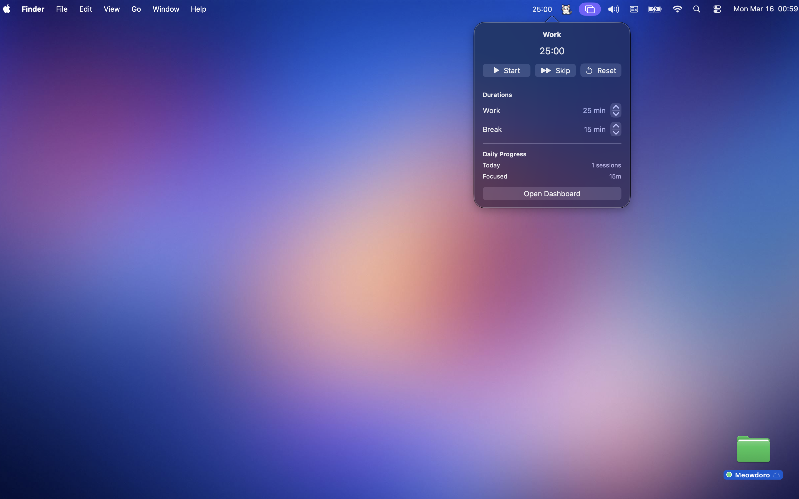
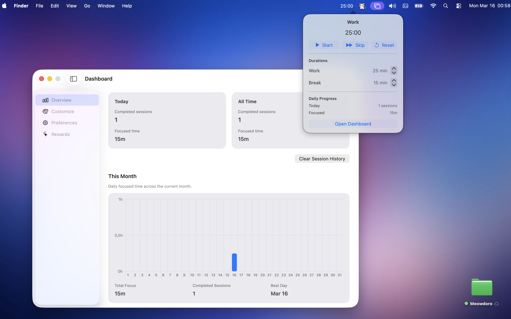
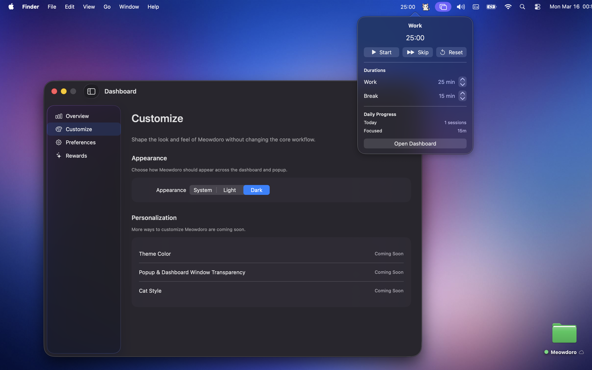

# Meowdoro 🐈

A tiny focus timer that lives in your Mac’s menu bar.

Meowdoro is a lightweight Pomodoro-style timer designed to help people stay focused without interrupting their workflow.

Instead of opening another productivity app, Meowdoro sits directly in the macOS menu bar so starting a focus session takes only one click.

---

## Why I built this

Many Pomodoro apps require opening a full window or switching context.

I wanted a focus timer that stays out of the way and integrates directly into the macOS menu bar, making focus sessions effortless to start.

This project was built as a small product experiment to explore minimal productivity tools.

---

## Screenshots

### Dashboard

### Dark Mode

### Notification

---

## Key Features

• Menu bar Pomodoro timer  
• Automatic work and break sessions  
• Lightweight dashboard with focus statistics  
• Native macOS experience  
• Minimal and distraction-free design  

---

## How it works

1. Click the cat icon in the macOS menu bar  
2. Start a focus session  
3. Meowdoro automatically manages work and break cycles  

The goal is to stay focused without interrupting your workflow.

---

## Built With

Swift  
SwiftUI  
macOS Menu Bar App architecture  

---

## Project Goals

This project explores:

• minimal productivity tooling  
• menu bar-first UX  
• lightweight macOS utilities  

---

## Download

Coming soon to the Mac App Store.

---

## Support

If you experience issues or have feedback, you can contact through the support form:

https://tally.so/r/9qlZRY

---

Built by **Gorkem Sertgumec**
